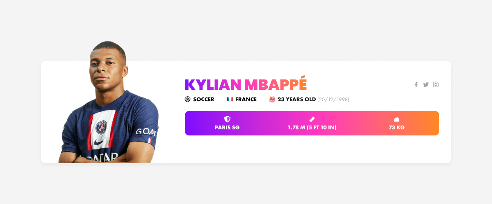

# Note au lecteur

Bonjour,

Premièrement, je vous remercie pour ce test technique.
Les informations relatives aux athlètes sur The Sports DB ne sont pas normalisées.
C'est pourquoi j'ai effectué des tests sur les IDs suivants :

[athlete ID=34172174]

[athlete ID="34162098"]

[athlete ID=34162089]

[athlete ID="34161115"]

[athlete ID="34153733"]

[athlete ID="34145410"]

[athlete ID="34161165"]

[athlete ID="34159843"]

En tenant compte d'athlètes de nom plus ou moins long, de différents sports (Soccer, Basketball, Golf), à la retraite (_Retired [Sport]), de nationalité américaine (ex : USA vs United States), de taille dont la mesure n'est pas définie (ex : uniquement 2.03 au lieu de 2.03 m), de masse corporelle dont la mesure n'est pas définie (ex: 103 au lieu de 103 kg), et dont les liens vers les réseaux sociaux peuvent comportés ou non le protocole (http ou https).

Je n'ai pas eu le temps de faire plus de tests sur d'autres athlètes dont les informations ne seraient pas normalisées.

Concernant la version responsive, afin de respecter le temps imparti, les icônes des réseaux sociaux sur support smartphone ont été cachées car elles sont de taille trop petite. J'aurais prévu un déplacement de celles-ci dans le DOM après le cadre équipe - taille - poids, et les afficher en 48 x 48px (taille minimum requise pour un lien sur smartphone).

# MyGoldenNetwork – Test technique

Dans le processus de recrutement au sein de MyGoldenNetwork, nous demandons à nos candidats la réalisation d'un test pratique à nous présenter. Celui-ci est une opportunité pour vous de nous démontrer vos compétences et que vous correspondez aux prérequis du poste. Pour la réalisation de celui-ci, nous vous fournissons les liens nécessaires pour la mise en place ainsi que le résultat attendu ([maquette Figma](player_card.fig)).

## Critères de jugement

- Compréhension du test
- Capabilité de recherche
- Structure et qualité du code
- Solution apportée

## Description du test

Création d'un plugin WordPress permettant à un utilisateur d'afficher des informations relatives à un athlète via l'insertion d'un shortcode dans le WYSIWYG. 

La récupération de ces informations doit se faire via l'API disponible sur le site internet [TheSportsDB](https://www.thesportsdb.com/). 

Ce shortcode doit comporter pour seul attribut l'ID de l'athlète qui sera préalablement recherché par l'utilisateur directement sur le site TheSportsDB (*aucune recherche n'est nécessaire dans l'espace administrateur de WordPress*). 
Le rendu de ce shortcode n'est attendu que pour la partie front du site web.

Pour la réalisation de ce plugin, vous devrez utiliser les fonctions natives de WordPress lorsque cela est possible. 
La gestion des possibles erreurs (*ex: ID de l'athlète incorrect*) et la gestion de l'affichage des informations si certaines sont manquantes (*ex: photo non disponible*) est à prévoir. 
Afin d'alléger le nombre de requêtes effectuées vers l'API et d'améliorer le temps de chargement du shortcode en front, la mise en cache du résultat d'une requête est requise.

Le rendu en front du shortcode doit être le même que celui fourni. 
L'utilisation du compilateur SASS afin de générer votre CSS est exigé. 
Aucune version responsive n'a été prévue dans la maquette, à vous d'adapter celle-ci selon votre créativité afin de rendre l'affichage de ce bloc optimal sur tous les supports.

## Livrable

Une fois que vous aurez terminé le développement du plugin, vous devrez effectuer un commit de celui-ci directement dans ce dépôt et nous en faire part.

*N'hésitez pas à nous contacter en cas d'incompréhension ou de question sur ce test bloquant votre avancée.*
